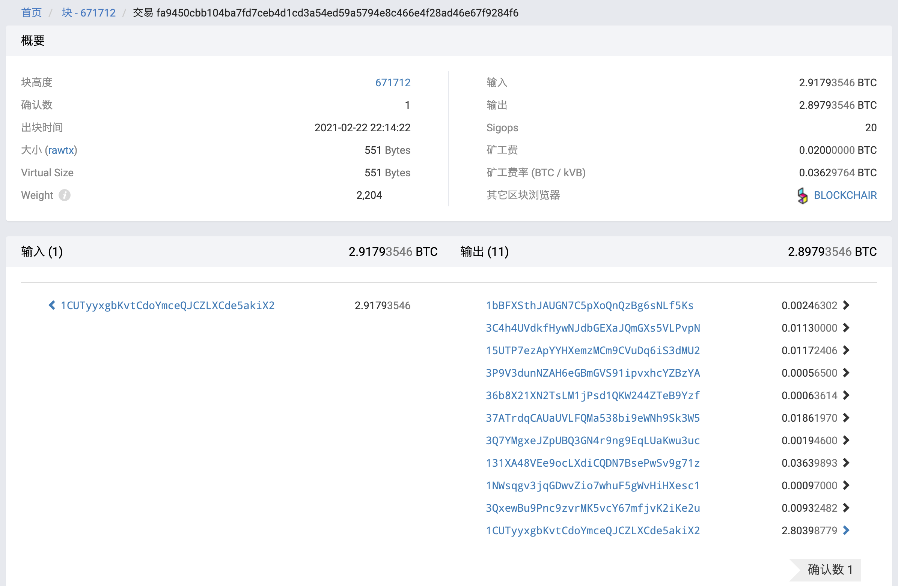

# 技术日记
## BTC(比特币) 浏览器怎么看？
https://btc.com/fa9450cbb104ba7fd7ceb4d1cd3a54ed59a5794e8c466e4f28ad46e67f9284f6

这个是一个 btc 区块浏览器的交易截图。可以分为 3 个部分：概要，输入，输出。
1. 概要

| key          | value               | explain  |
|--------------|---------------------|----------|
| 块高度          | 671712              | 比特币的块高度  |
| 确认数          | 1                   | 距离最高高度的值 |
| 出块时间         | 2021-02-22 22:14:22 | 块出现的时间   |
| 大小 (rawtx)   | 551 Bytes           |          |
| Virtual Size | 551 Bytes           |          |
| Weight       | 2,204               |          |

2. 输入
3. 输出